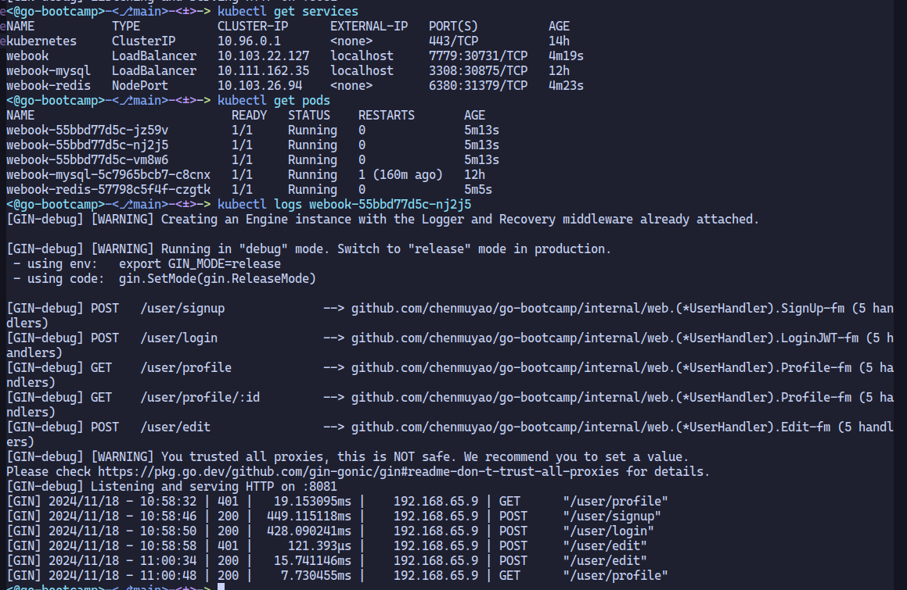

# go-bootcamp
Geekbang Go Basic Bootcamp

## v0.0.3

- [X] Rate limiter middleware
- [ ] Unit tests
- [ ] Use zap logger everywhere
- [ ] Update k8s deploys with conf and etcd
- [ ] Sync -> Async
  - [ ] Average response time
    - [ ] absolute value
    - [ ] trend (%x increase in 1 second)
  - [ ] Error rate (X% during some time)
  - [ ] Stop async mode
    - [ ] After N minutes
    - [ ] keep a percentage of sync request (using random number), if the sync request is ok (response time, no error), then gradually increase the sync percentage
  - [ ] Preempt send : Select for Update, only one instance can succeed to update the update time, then it continues to send the message, other instances will not query this record because it is now too recent.

- [ ] Gin Refresh & Access Token Middleware
    - Generate Token interface
    - Generate JWT token
    - Session or not
    - (jwt.Handler + login_jwt middleware)
